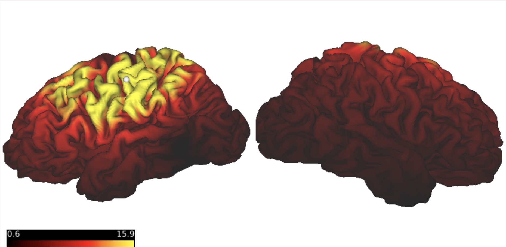

# Efield Generator 

## Overview 
This function takes as input the path to a processed data ([BIDS outputs](https://bids.neuroimaging.io)) and the atlas (or Native) coordinates of the target to stimulate and based on that generates the corresponding Efield distribution. The following is a flow diagram detailing the specific steps in this function. 

 

## Data Preparation

### Command-Line Arguments

```
usage: efield_generator.py [-h] [-XYZ_native XYZ_NATIVE [XYZ_NATIVE ...]]
                           [-XYZ_atlas XYZ_ATLAS [XYZ_ATLAS ...]]
                           -path_mri_processed_data PATH_MRI_PROCESSED_DATA
                           -output_folder OUTPUT_FOLDER
                           -full_path_to_simnibs_container
                           FULL_PATH_TO_SIMNIBS_CONTAINER
                           -full_path_to_simnibs_cifti_tools
                           FULL_PATH_TO_SIMNIBS_CIFTI_TOOLS
efield_generator.py: error: the following arguments are required: -path_mri_processed_data, -output_folder, -full_path_to_simnibs_container, -full_path_to_simnibs_cifti_tools
``` 

### Mandatory System Requirements  

In order to run the Efield generator, the fuction requires the following:

-path_mri_processed_data: Path to processed data (derivatives) in BIDS format, the processed data needs to contain the T1 nifti file and optionally the T2 nifti file 

-XYZ_native or -XYZ_atlas: Coordinates of the target to stimulate X, Y and Z in Native space (or atlas space) Grayordinate (Simnibs Cifti Tools is able to convert between Native and Atlas coordinates) 

-output_folder: The generated outputs are stored in a standardized format in the designated output folder. 

### Outputs 
The Efield generator creates the following functions:

- Efield files
  - Volume (masked and unmasked)
    - Atlas
    - Native
  - Surface (gifti and cifti)
    - atlas
    - Native
  - Coil position : This is a matrix within a text file in Brainsight structure
  - Auxiliary outputs
    - FEM

## Running an Example 

The procedure to submit a job for one or several subjects and one or several coordinates per subject is as follows:

1) Copy the folder [submit jobs](https://github.com/DCAN-Labs/simnibs_cifti_tools/tree/develop/submit_jobs)  into a local folder
2) Open a terminal window and connect into a MSI session
3) Edit the list_subj file with the paths of the subject data to run (one subject per line) 

### list_subj
```
/path_to/full_processed_data_outputs/sub-00XXX1/ses-V1/
/path_to/full_processed_data_outputs/sub-00XXX2/ses-V1/
...
/path_to/full_processed_data_outputs/sub-00XXXN/ses-V1/
```     
    
3) Edit both coordinates files list_coord1 and list_coord2. This can be in either Atlas or Native space, but must be consistent between files, if coordinates in list_coord1 are in atlas, list_coord2 must be in atlas too. File list_coord1 must contain only one coordinate (Format : X Y Z, in mm). All the remaining coordinates to be calculated must be placed in list_coord2 (Format : X Y Z in mm) with one coordinate per line. 

### list_coord1

```
-46 -30 61
```

### list_coord2
```
39 -18 64
-50 28 23
...
50 28 23
```

4) Edit output_folder variable in **submit_jobs.sh** file as 

```
output_folder=/path/to/output/
```  
5) To use inform the script you are using NativE or Atlas space coordinate, you have to edit in the file **run_one_job.sh** the following line 
where "XYZ_atlas" has to be used if the coordinates are in Atlas, and "XYZ_native" if the coordinates are in native space. In the line above the flag is set as "XYZ_atlas"
```
python $full_path_to_simnibs_cifti_tools/efield_generator/efield_generator.py -XYZ_atlas $coordinates \
-path_mri_processed_data $path_mri_processed_data \

```

Once complete the previous edit, you can run all the jobs by executing the main script submit_jobs.sh . 
This script runs first the FEM generation, then calculates the coil position and corresponding Efield for the coordinate in list_coord1. Once the process is done, it calculates the coil position and corresponding Efield for all the coordinates in list_coord2. 
The script calls in parallel the run_one_job.sh script for all the participants listed in list_subj. 

```
source submit_jobs.sh
```

## Optional parameters
### Node specs in run_one_job.sh script
The script to be ran per each participant data are defined at the begining of the script
The current parameters requested as resources were tested to be suficient to run the analysis.  
```
#SBATCH -J efield_job
#SBATCH --nodes=1
#SBATCH --ntasks-per-node=1
#SBATCH --cpus-per-task=4
#SBATCH --mem=16gb
#SBATCH -t 8:00:00
#SBATCH -p small,amdsmall
#SBATCH -A miran045
```


## Output Folder Structure 
Once a run is completed, all the files will be saved in the folder you defined as output folder (in this example is `/home/example1/Pilottest`). This folder will contain the following subfolders:

```markdown
├── /home/example1  
    ├── Pilottest
        └── SubjectID        
            └── session
                ├── coord_x_y_z
                   └── derivatives
                       └── Atlas
                       └── Native                   
                   ├── Efield
                       └── Cifti
                           └── Atlas
                           └── Native 
                       ├── Surface
                           └── Atlas
                           └── Native                   
                       └── Volume
                           └── Atlas
                           └── Native                  
                   ├── sim
                       └── fsavg_overlays
                       ├── mni_volumes                
                       ├── subject_overlays            
                       └── subject_volumes              
                   └── opt                 
                └── FEM
```
        
## Exploring Outputs 

### FEM

This pipeline calculates the the Finite element model (FEM) for each subject  Once the Finite element model (FEM) is generated, multiple coordinates can be run in parallel. This pipeline calculates the the Finite element model (FEM) for each subject  Once the Finite element model (FEM) is generated, multiple coordinates can be run in parallel. This pipeline calculates the the Finite element model (FEM) for each subject  Once the Finite element model (FEM) is generated, multiple coordinates can be run in parallel. 

 

FEM image opened in Gmesh

### Optimization Matrix 

Based on the desired coordinates of simulation, the pipleine produces and stores the the optimal coordinate postion for all cases. Simnibs Cifti Tools also converts the matrix into a form ready for Efield generator and [Brainsight](https://brainbox-neuro.com/products/brainsight-tms-navigation), a neuronavigation system that is essential in improving the accuracy, reliability, and repeatability of non-invasive brain stimulation experiments. 

The matrix defining coil position and directions has the form


$$Optimization Matrix ('opt_matrix.txt') = \begin{bmatrix}-0.77304659,,-0.24579915,,,0.58479206,-70.29989339\\
-0.4793134,,,,0.83019517,,-0.28466585,-23.82286829\\
-0.41552092,,-0.50035864,,-0.75959437,,61.92179034\\
0.,,,,,,,,,,,0.,,,,,,,,,,,0.,,,,,,,,,,,1.,,,,,,,
\end{bmatrix}$$

### Efield Volume 
Simnibs Cifti Tools produces Efield volumes in subject native and atlas (MNI) space. In this example, the target coordinate (to be stimulated) is 

```markdown 
-44 -30 55
```   

#### Efield Volume Atlas 


#### Efield Volume Native 


### Efield Cifti 
The pipline includes Connectivity Informatics Technology Initiative (CIFTI) files. Cifti file format supports a variety of connectome-specific data representations as cortical gray matter data modeled on surfaces and subcortical gray matter data modeled in volumetric parcels. CIFTI format ensures that all grayordinates will be aligned between subjects.
#### Efield Cifti Atlas 
 

#### Efield Cifti Native 
 


## Considerations 
Memory and time depends on number of subjects and coordinates of interest. The amount of space required can be estimated using ( equation from google sheet). In the usage example, we ran (#) partipants analyzing (#) coordinates for each partipant. This example required (#) GB of space and completed in(amt of time).

