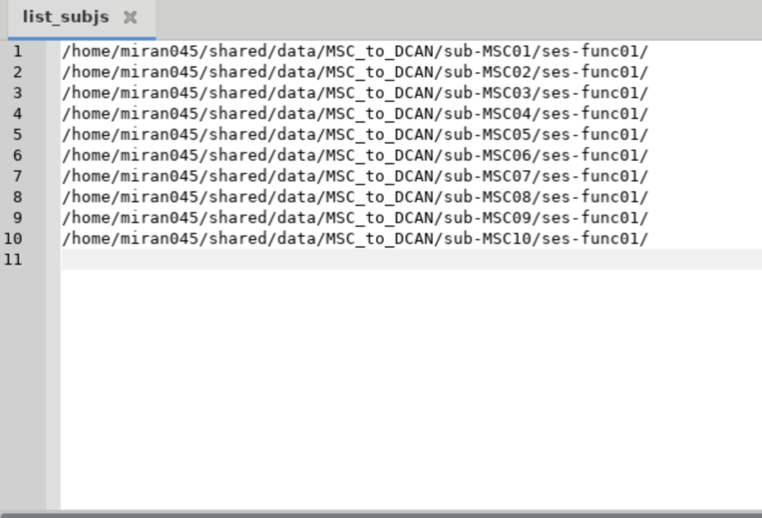
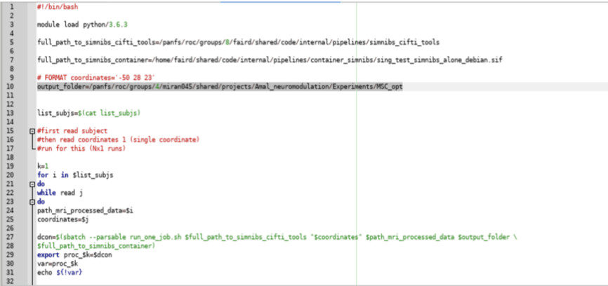
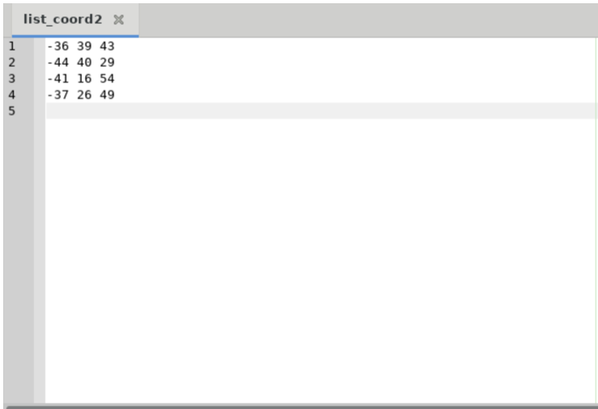

## System Requirements
- Simnibs 
- Python 
- more? 

## Instructions 
1. Download Simnibs Cifti Tools (Provide instructions) 
2. Open the folder …/simnibs_cifti_tools/submit_jobs  
3. In the submit_jobs folder, edit the list_subjs file and add the paths to the subject data: Provide link to information on necessary data and formatting Path to data example: /home/miran045/shared/data/MSC_to_DCAN/sub-MSC01/ses-func01/ 
 
5. In the submit_jobs folder, edit the line 10 of submit_jobs.sh to define an output folder in the following format and save the changes output_folder=/panfs/roc/groups/4/miran045/shared/projects/Amal_neuromodulation/Experiments/MSC_opt 
 
7. In the submit_jobs folder, edit the list_coord2 file with the desired number of coordinates in the following format X Y Z with one coordinate per line. If the desired output folder does not have the FEM calculated already, edit list_coord1 with one coordinate to allow for FEM calculation  
 
9. Once subject data, coordinates, and output folder have been defined, run the script submit_jobs.sh to request resources and submit all jobs at once
